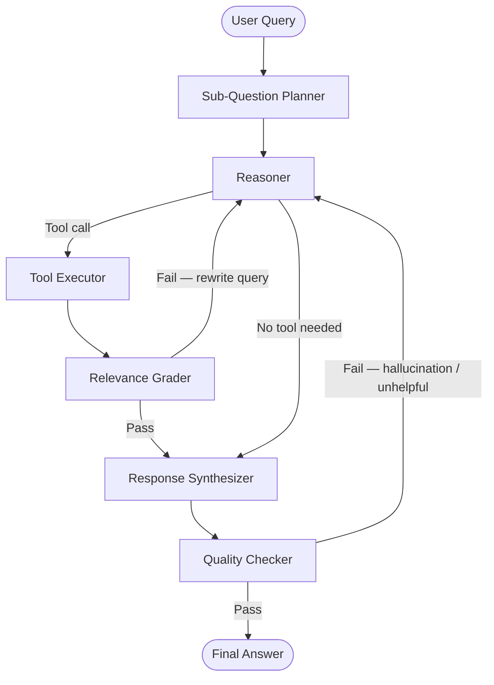

# Griffin: Financial Data Q&A Assistant using Graph RAG


A financial question-answering assistant for non-experts, powered by an agentic Graph RAG pipeline built with LangGraph. Griffin autonomously routes between live market data, macroeconomic indicators, a curated knowledge base, and web search — grading its own retrieval quality and correcting itself before responding.

---

## Table of Contents

- [Motivation](#motivation)
- [Why Graph RAG?](#why-graph-rag)
- [Architecture](#architecture)
- [Data Sources](#data-sources)
- [Project Structure](#project-structure)
- [Setup](#setup)
- [Usage](#usage)
- [Example Interactions](#example-interactions)
- [Known Limitations](#known-limitations)

---

## Motivation

Traditional financial Q&A systems suffer from two fundamental limitations: they either rely on static, rapidly outdated training data, or they retrieve flat, disconnected text chunks that lack the relational context critical to financial analysis. A question like _"How does Company X's P/E ratio compare to its sector peers?"_ requires combining live data, historical context, and conceptual explanation — something conventional vector-similarity RAG handles poorly.

Griffin addresses this by combining **live financial data**, a **curated educational knowledge base**, and a **self-correcting LangGraph agent loop** that reasons about which source to query, grades what it retrieves, and rewrites its approach if the result isn't good enough.

The target user is someone without a finance background who wants honest, grounded, plain-language answers.

---

## Why Graph RAG?

| Approach | Limitation | Griffin's Advantage |
|---|---|---|
| **Parametric LLM** | Stale training data; hallucination risk on numerical facts | Grounds responses in retrieved, up-to-date structured data |
| **Vector RAG** | Flat chunk retrieval; single-pass, no self-correction | Self-correcting agent loop rewrites queries and re-retrieves if grading fails |
| **SQL/API lookup** | Rigid queries; no natural-language interface | Agent dynamically decides which tool to call based on query intent |

---

## Architecture

The agent graph is built with [LangGraph](https://github.com/langchain-ai/langgraph) as a `StateGraph`. Each query flows through a reasoning and self-correction loop before a response is generated.



**Nodes:**

| Node | Role |
|---|---|
| **Sub-Question Planner** | Decomposes compound queries into atomic tool calls |
| **Reasoner** | LLM decides which tool to call or whether to answer directly |
| **Tool Executor** | Dispatches to the selected tool and appends result to state |
| **Relevance Grader** | LLM-as-judge — scores retrieval quality; rewrites query and loops back if irrelevant |
| **Response Synthesizer** | Generates a beginner-friendly answer with source citations |
| **Quality Checker** | Two binary checks: hallucination and usefulness; loops back if either fails (max 3 retries) |

**State schema tracks:** messages, retrieved documents, tool call history, grading results, retry counter.

---

## Data Sources

| Source | Tool | Data | TTL Cache |
|---|---|---|---|
| [Alpha Vantage](https://www.alphavantage.co/) | `fetch_stock_data` | Live prices, P/E, EPS, market cap, earnings | 15 min |
| [FRED](https://fred.stlouisfed.org/) | `fetch_economic_data` | CPI, Fed funds rate, unemployment, GDP, VIX | 24 hr |
| [Yahoo Finance](https://finance.yahoo.com/) | `fetch_chart_data` | Historical price charts, multi-ticker comparison | 15 min |
| ChromaDB (Investopedia) | `retrieve_educational_content` | Beginner-friendly concept explanations | No expiry |
| DuckDuckGo | `web_search` | Real-time news, analyst commentary | No cache |

**FRED series covered:** `CPIAUCSL`, `T10YIE`, `FEDFUNDS`, `DGS10`, `MORTGAGE30US`, `UNRATE`, `PAYEMS`, `SP500`, `VIXCLS`

---

## Project Structure

```
graphrag/
├── app.py                  # Streamlit chat UI
├── tools.py                # LangChain @tool definitions (5 tools)
├── vectorstore.py          # ChromaDB initialisation and retriever
├── data_loaders/
│   ├── fetcher.py          # HTTP layer — Alpha Vantage, FRED, yfinance (with TTL caching)
│   └── utils.py            # Factory-pattern URL builders for Alpha Vantage and FRED
├── rag/
│   ├── agent_graph.py      # LangGraph StateGraph definition
│   └── llm.py              # LLM wrapper (FinGPT / phi-2 / API model)
├── data/
│   ├── educational_urls.txt # URLs to scrape for the knowledge base
│   └── chroma/              # Persisted ChromaDB collection (generated)
└── docs/
    └── PLANNING.md         # Architecture planning notes
```

---

## Setup

**Prerequisites:** Python 3.12+, a GPU for local FinGPT inference (optional — see [Known Limitations](#known-limitations))

```bash
# 1. Clone and enter the repo
git clone <repo-url>
cd graphrag

# 2. Create and activate virtual environment
python -m venv .venv
source .venv/bin/activate   # macOS/Linux

# 3. Install dependencies
pip install -r requirements.txt

# 4. Configure environment variables
cp .env.example .env
# Edit .env and fill in your API keys
```

**`.env` file:**

```
ALPHA_VANTAGE_API_KEY=your_key_here
FRED_API_KEY=your_key_here
LLM_PROVIDER=openai          # "openai" | "local" (FinGPT/phi-2)
OPENAI_API_KEY=your_key_here # only needed if LLM_PROVIDER=openai
```

> Alpha Vantage free tier: 5 API calls/minute, 500/day. Get a key at [alphavantage.co](https://www.alphavantage.co/support/#api-key).
> FRED API key: free, register at [fred.stlouisfed.org](https://fred.stlouisfed.org/docs/api/api_key.html).

**Build the knowledge base** (one-time, scrapes educational URLs and populates ChromaDB):

```bash
python -c "from vectorstore import init_vectorstore; init_vectorstore()"
```

---

## Usage

```bash
streamlit run app.py
```

The Streamlit UI exposes a chat interface with pre-populated sample questions. Intermediate agent reasoning steps — tool selections, retrieved data, grading verdicts — are visible in expandable panels alongside the final answer.

---

## Example Interactions

**"What does P/E ratio mean and is Apple's P/E good right now?"**
- `retrieve_educational_content` → retrieves "what is P/E ratio" chunk from ChromaDB
- `fetch_stock_data("AAPL")` → Alpha Vantage OVERVIEW: P/E = 28.5
- *"P/E ratio measures how much investors pay for each $1 of earnings. Apple's current P/E of 28.5 is slightly above the tech sector average of ~25, meaning the market prices in continued growth…"*

**"The news says inflation is rising — what does that mean for me?"**
- `fetch_economic_data("inflation")` → FRED: CPI at 3.2%, 10-yr breakeven at 2.8%
- `retrieve_educational_content` → "what is inflation and how does it affect purchasing power"
- `web_search` → recent Fed commentary
- *"Inflation at 3.2% means prices are rising faster than usual. In practical terms…"*

---

## Known Limitations

| Limitation | Detail |
|---|---|
| **Alpha Vantage rate limit** | Free tier: 5 calls/min. Agent loop retries may exhaust this on complex queries. |
| **FinGPT hardware requirement** | `llama2-7B` 4-bit quantized requires ~6 GB VRAM. Set `LLM_PROVIDER=openai` to use an API model instead. |
| **Cold-start rebuild** | Vector store is rebuilt on first run if no persisted index exists. Takes ~2–3 min depending on the number of URLs. |
| **Yahoo Finance builder** | Registered in `APIProvider` enum but HTTP implementation is not yet complete. `fetch_chart_data` falls back to `yfinance` directly. |
| **No authentication** | Streamlit UI has no auth layer — not intended for public deployment in current form. |
